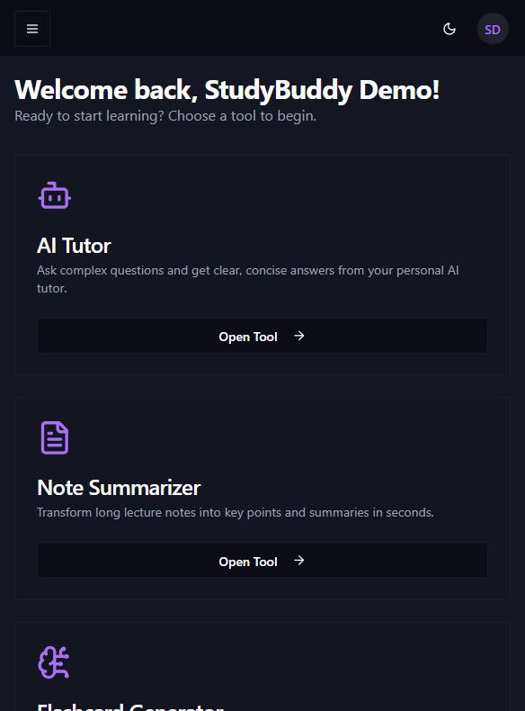
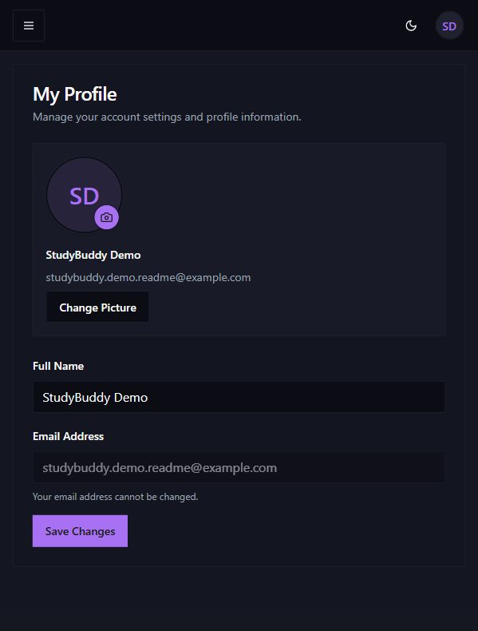
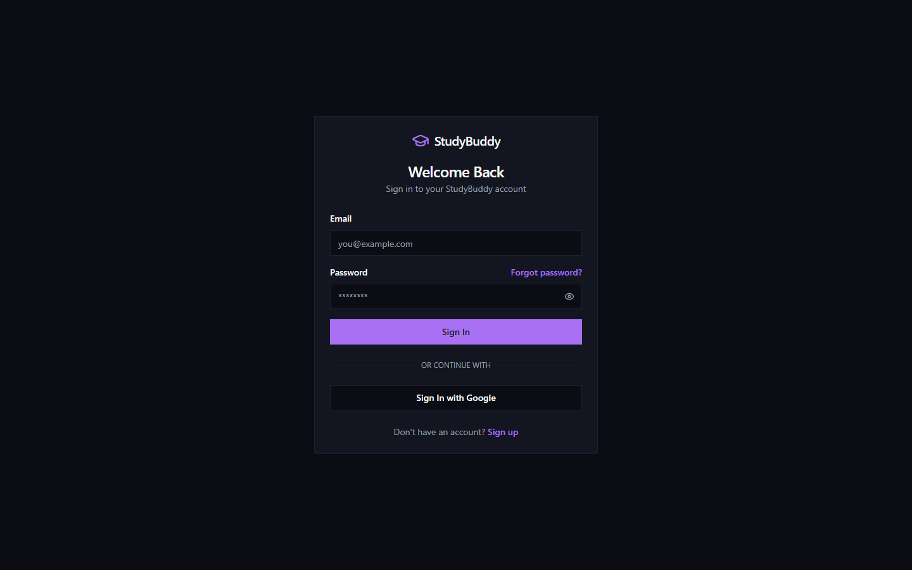
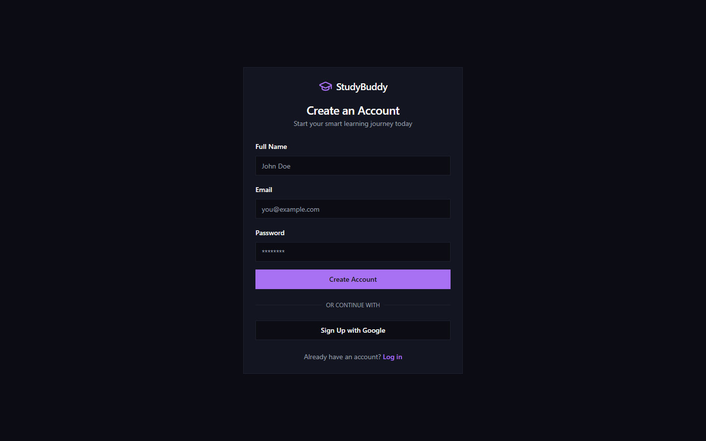

# StudyBuddy

StudyBuddy is a full-stack AI study assistant built with Next.js, Firebase, and the Gemini API. It helps students ask study questions, summarize notes, generate flashcards, create quizzes, search books, and save study history behind Firebase Authentication.

Live app: [https://studybuddy-backend--studybuddy-4f855.us-central1.hosted.app](https://studybuddy-backend--studybuddy-4f855.us-central1.hosted.app)

## Walkthrough


## Screenshots

| Home | Dashboard |
| --- | --- |
|  |  |

| Profile | Sign In |
| --- | --- |
|  |  |

| Sign Up |
| --- |
|  |

## Features

- AI Tutor: ask questions, receive structured explanations, and continue saved conversations.
- Note Summarizer: paste notes or upload `.txt` / `.md` files and generate concise summaries.
- Flashcard Generator: create up to 12 flashcards from a study topic.
- Quiz Generator: create up to 8 multiple-choice or true/false questions with explanations.
- Book Search: search Open Library for book metadata and cover images.
- Study History: save, view, continue, and delete prior study sessions.
- Profile: update display name and upload a validated avatar image.
- Authentication: Firebase Email/Password and Google sign-in support.

## Tech Stack

- Next.js App Router
- React 19
- TypeScript
- Tailwind CSS
- Firebase Authentication
- Cloud Firestore
- Firebase Storage
- Firebase App Hosting
- Gemini API through the REST endpoint
- Open Library Search API

## Project Structure

```text
src/app              Next.js routes, layouts, and server actions
src/ai               Gemini REST helper and AI feature flows
src/components       Shared UI and dashboard components
src/hooks            Client-side React hooks
src/lib              Firebase config, app constants, limits, and utilities
src/types            Shared TypeScript data models
docs                 Project blueprint and backend reference notes
firestore.rules      Firestore authorization and validation rules
storage.rules        Firebase Storage avatar rules
apphosting.yaml      Firebase App Hosting runtime configuration
```

## Firebase Resources

Use Firebase project `studybuddy-4f855` / project number `32468092136`.

Required resources:

- Web app: use the `StudyBuddy-web` app config from `.env.example`.
- Authentication: enable Email/Password and Google sign-in.
- Authorized domains: add the live App Hosting domain and local development domains.
- Cloud Firestore: create the database, then deploy `firestore.rules` and `firestore.indexes.json`.
- Firebase Storage: create the default bucket `studybuddy-4f855.firebasestorage.app`, then deploy `storage.rules`.
- Firebase App Hosting: backend `studybuddy-backend` in `us-central1`.
- Gemini API: create a Google AI Studio API key and store it as `GEMINI_API_KEY`.

## Environment Variables

Create `.env.local` from `.env.example` for local development.

```sh
GEMINI_API_KEY=your_google_ai_studio_key
GEMINI_MODEL=gemini-2.5-flash-lite
```

Do not reuse the Firebase web app API key as the Gemini key. Gemini requires a Google AI Studio key with access to `generativelanguage.googleapis.com`.

For the lowest-risk no-cost setup, use a Google AI Studio Free Tier API key from a project that is not attached to paid/prepay Gemini billing. If Gemini returns `prepayment credits are depleted`, create a Free Tier AI Studio key or add credits only if you accept paid usage.

## Local Development

Install dependencies:

```sh
npm ci
```

Run the development server:

```sh
npm run dev
```

Open [http://localhost:9002](http://localhost:9002).

## Quality Checks

Run the local verification suite:

```sh
npm run lint
npm run typecheck
npm run build
npm audit --audit-level=moderate
```

## Deployment

Deploy Firebase resources and App Hosting:

```sh
firebase login
firebase use studybuddy-4f855
firebase apphosting:secrets:set GEMINI_API_KEY
firebase deploy
```

Deploy only App Hosting after code changes:

```sh
firebase deploy --only apphosting --project studybuddy-4f855
```

Deploy only Firestore and Storage rules:

```sh
firebase deploy --only firestore,storage --project studybuddy-4f855
```

## Security Notes

- Firebase web config is public by design; access is enforced through Authentication, Firestore rules, Storage rules, and API key restrictions.
- Protected server actions verify the user's Firebase ID token before calling Gemini or proxying protected requests.
- Firestore rules validate user ownership, document shape, list sizes, and text limits before allowing writes.
- Storage rules restrict avatar writes to the signed-in user's folder, validated image MIME types, safe filenames, and files under 2 MB.
- Gemini secrets are stored in Firebase App Hosting / Secret Manager, not in the client bundle.
- External Open Library responses are validated before rendering.
- AI input sizes and output tokens are capped to reduce abuse and control cost.

## Cost Notes

Firebase App Hosting requires the Blaze plan, so strict $0 hosting cannot be guaranteed. This project keeps `minInstances: 0`, caps `maxInstances: 2`, and uses `gemini-2.5-flash-lite` to keep normal portfolio traffic within no-cost usage where possible. 
